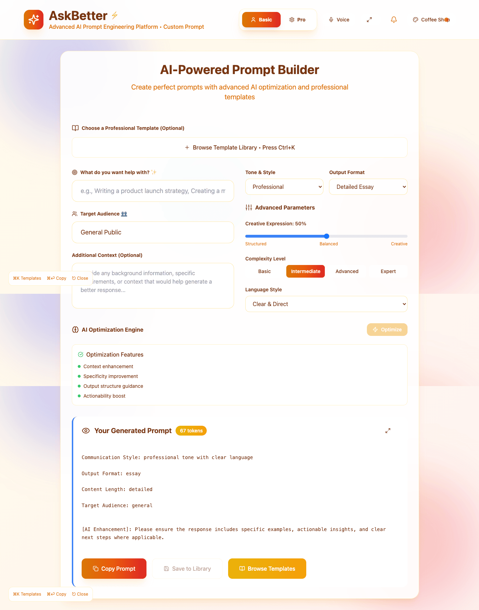
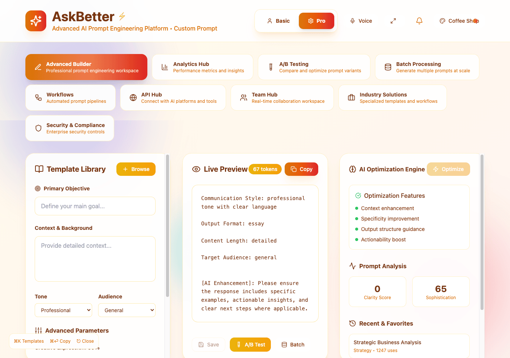

# AskBetter – Human-Friendly AI Prompt Assistant

## Project Overview

AskBetter is a personal tool built to simplify the way people interact with AI. It offers a guided, step-by-step flow that helps users create better prompts, even if they don’t understand how AI systems work behind the scenes.

This project was built during my first year at Noroff as a Front-End Development student. It's a standalone app and part of my portfolio submission. The goal was to demonstrate not only coding and design skills, but also a creative solution to a real usability issue.

AskBetter is designed using React (via Vite), Tailwind CSS, and Framer Motion. The design reflects a calm, structured approach aimed at reducing friction for users who feel overwhelmed or unsure about prompt engineering.

---

## Links

- Live site: [https://askbetter.vercel.app](https://askbetter.vercel.app)
- GitHub repo: [https://github.com/sergiu-sa/askbetter](https://github.com/sergiu-sa/askbetter)

---

## Screenshot




---

## How to Use

1. Choose your goal (e.g., write a summary, create a message)
2. Set the tone, complexity, and urgency sliders
3. Add optional mood or assistant preferences
4. Preview your prompt in real time
5. Copy the result or use it with your preferred AI tool

---

## Tech Stack

- React (with Vite)
- Tailwind CSS
- Framer Motion for animations
- React Portals (for overlay elements)
- Local Storage (for theme persistence)
- Vanilla JavaScript logic for state and behavior

---

## Features

- Guided, multi-step interface
- Theme selection panel using React Portals
- Real-time prompt preview
- Slider controls for tone, complexity, and urgency
- Mobile and desktop responsive layout
- Clean, accessible markup and logical structure

---

## Project Goals

- Make AI more usable and friendly to non-technical users
- Reduce guesswork in prompt writing
- Explore calm UI patterns with minimal distraction
- Practice advanced component logic and state management

---

## Installation

To run locally:

```bash
git clone https://github.com/sergiu-sa/askbetter.git
cd askbetter
npm install
npm run dev
```

To build for production:

```bash
npm run build
```

---

## Folder Structure

```bash
askbetter/
│
├── public/           Static assets
├── src/
│   ├── assets/       Fonts, images, videos
│   ├── components/   Reusable interface components
│   ├── pages/        Step-based UI flows
│   ├── utils/        Prompt logic and helpers
│   └── styles/       Tailwind and custom CSS
```

---

## My Role

I designed and developed the entire AskBetter MVP from scratch. This includes:

- Research and concept development
- UX writing and layout decisions
- Implementing React component architecture
- Building logic for tone/urgency/mood input
- Creating a consistent visual design system
- Managing the Vite + Tailwind setup and deployment

---

## Learning Outcomes

- Gained hands-on experience with React and Vite
- Learned how to use React Portals for UI overlays
- Practiced using Framer Motion for modern animations
- Improved in accessibility, responsiveness, and layout control
- Explored UI design principles like progressive disclosure and emotional simplicity

---

## Current Status

This project is still under active development (Work In Progress).

Version 1 is publicly available. Planned improvements for the next version:

- Voice-to-prompt feature
- GPT integration with live feedback
- User account support
- History and favorite prompts
- More themes and accessibility options

---

## Contact

If you want to collaborate or give feedback:

- Email: sergiudsarbu@gmail.com
- GitHub: [https://github.com/sergiu-sa](https://github.com/sergiu-sa)
